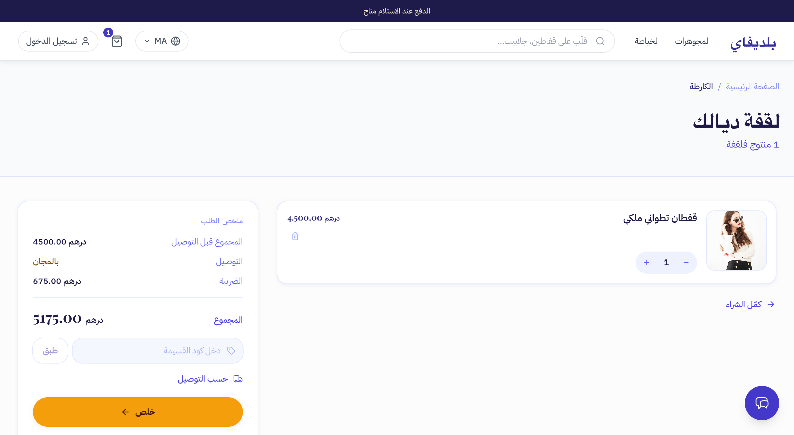
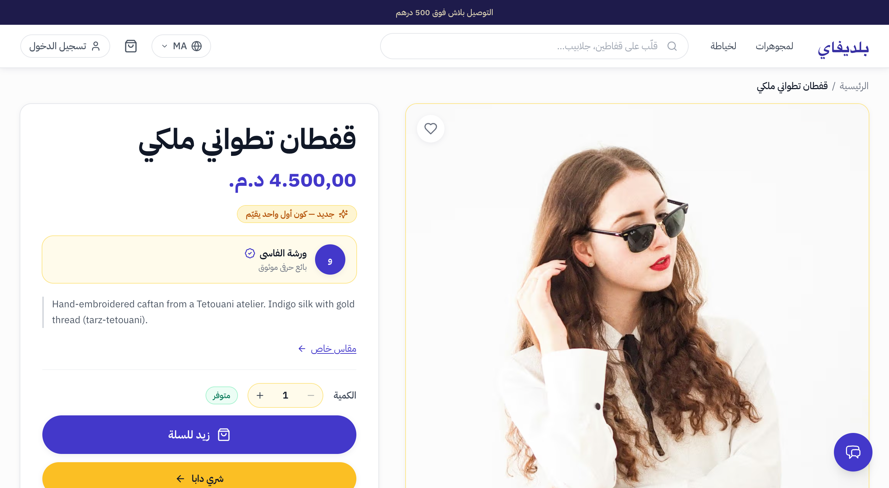
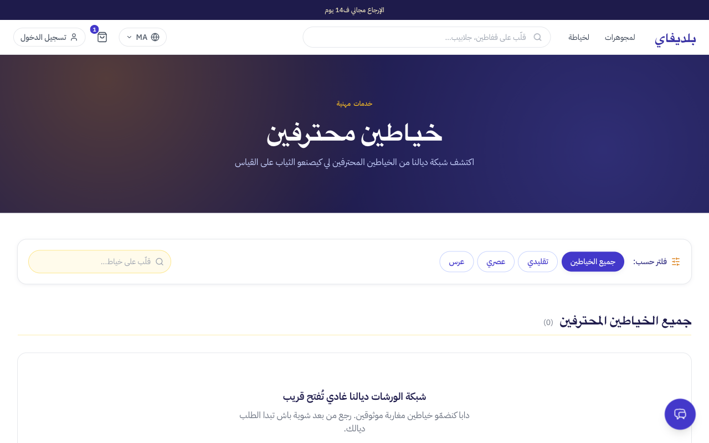

# Dogfood Report: Beldify (www.beldify.com)

| Field | Value |
|-------|-------|
| **Date** | 2026-07-09 |
| **App URL** | https://www.beldify.com |
| **Session** | beldify-com |
| **Scope** | Public storefront (home, catalog, PDP, search, cart, checkout, language switch, mobile viewport). Logged-out (guest) user. |

## Summary

| Severity | Count |
|----------|-------|
| Critical | 1 |
| High | 1 |
| Medium | 4 |
| Low | 3 |
| **Total** | **9** |

> Note: the site renders in Moroccan Darija (Arabic dialect) by default. Working features observed: search (returns correct results), add-to-cart + quantity, language switch (7 languages), mobile responsive layout with hamburger menu, recently-viewed section.

## Issues

### ISSUE-001: Guest checkout is completely broken — no way to complete a purchase

| Field | Value |
|-------|-------|
| **Severity** | critical |
| **Category** | functional |
| **URL** | https://www.beldify.com/cart |
| **Repro Video** | N/A |

**Description**
The cart page has three checkout-related controls, and none of them let a guest user proceed to payment:
- The primary CTA "كمّل الشراء" (Complete Purchase) is a **link to `/products`** (the catalog), not a checkout page. There are two such buttons (main summary + sticky mini-summary) both pointing to `/products`.
- The "خلص" (Pay) button does **nothing** — clicking it produces no navigation, no modal, no error, no console message. It only receives focus.

A guest shopper who adds a product and opens the cart has no path to pay. This blocks the core revenue workflow.

> Note: login is required to register as a seller (`/seller/register` gates behind `/login`), so a logged-in checkout path may exist. It could not be verified here (no test account). However, the two defects below are independently wrong regardless of auth state: the "Complete Purchase" button routes to the catalog, and the "Pay" button has no handler.

**Repro Steps**

1. Add any product to cart (e.g. open `/products/1` and click "زيد للسلة").
   

2. On `/cart`, click "كمّل الشراء" (Complete Purchase).
   **Observe:** browser navigates to `/products` (catalog) instead of a checkout page.

3. Return to `/cart` and click "خلص" (Pay).
   **Observe:** nothing happens — no checkout, no error. The purchase cannot be completed.

---

### ISSUE-002: Extra leading alef on Arabic definite articles site-wide ("االمنتوج", "االلغة", "االخياطة")

| Field | Value |
|-------|-------|
| **Severity** | high |
| **Category** | content |
| **URL** | All pages (header, footer, PDP, etc.) |
| **Repro Video** | N/A |

**Description**
Arabic definite articles are rendered with a stray leading alef (ء), producing strings like:
- "االمنتوج" → should be "المنتوج" (the product)
- "االلغة" → should be "اللغة" (the language)
- "االخياطة" → should be "الخياطة" (tailoring)

These appear in the language-toggle button ("بدّل االلغة"), the footer ("االخياطة"), the PDP ("تفاصيل االمنتوج", "أقسام االمنتوج"), the login page ("االمفضلة" → should be "المفضلة"), and the community page ("االوقت" → "الوقت", "باالعروض" → "بالعروض"). This is a localized-string defect (an extra `ا` prepended to the `ال` article) affecting the whole Darija/Moroccan-Arabic locale. English locale is unaffected ("Change language", "Tailoring", "Favorites").

**Repro Steps**

1. Open any page in the default (Darija) locale, e.g. `/products/1`.
   **Observe:** button reads "بدّل االلغة" and section headers read "تفاصيل االمنتوج" / "أقسام االمنتوج".
   

2. Scroll to footer.
   **Observe:** link reads "االخياطة" instead of "الخياطة".

---

### ISSUE-003: Price-range filter is non-functional

| Field | Value |
|-------|-------|
| **Severity** | medium |
| **Category** | functional |
| **URL** | https://www.beldify.com/products (and search results) |
| **Repro Video** | N/A |

**Description**
The "PRICE RANGE / نطاق تمن" filter inputs are broken. Both the Min and Max spinbuttons report `valuemin="0"` and `valuemax="0"`, i.e. the max price bound is 0, so no valid range can be entered. Typing a Min value (e.g. 1000) is ignored: the URL updates to `minPrice=0` and the product list does not filter (a 3,900 MAD product still shows).

The **same defect affects the community "market" budget filter** (`/community`): the Min/Max budget spinbuttons also report min=0/max=0 and the "طبّق" (Apply) button is disabled. This is a systemic filter/number-input bug, not isolated to the catalog.

**Repro Steps**

1. Go to `/products` and open the Filter panel.
   **Observe:** Min/Max price fields show no values and have min=0/max=0 bounds.

2. Enter 1000 in the Minimum price field and 5000 in Maximum.
   **Observe:** URL becomes `...&minPrice=0`; product grid is unchanged (all 5 caftans still listed, including the 3,900 MAD one). No filtering occurs.

---

### ISSUE-004: Distinct products share the same image

| Field | Value |
|-------|-------|
| **Severity** | medium |
| **Category** | content |
| **URL** | https://www.beldify.com/products |
| **Repro Video** | N/A |

**Description**
Several different products display identical images, making the catalog look duplicated/low-quality:
- "Tetouani Royal Caftan" (product 1) and "Fes Brocade Caftan" (product 4) both use `photo-1583846783214-7229a91b20ed`.
- "Saffron Wedding Caftan" (product 2) and "Andalusian Cobalt Caftan" (product 5) both use `photo-1594633312681-425c7b97ccd1`.

This is visible on the homepage hero, catalog, and PDP. Data/asset assignment bug.

**Repro Steps**

1. Open `/products` (English locale for clarity) and compare product cards.
   **Observe:** products 1 & 4 show the same photo; products 2 & 5 show the same photo.

---

### ISSUE-005: Test/seed data shipped to production

| Field | Value |
|-------|-------|
| **Severity** | medium |
| **Category** | content |
| **URL** | https://www.beldify.com/ (and /products) |
| **Repro Video** | N/A |

**Description**
The live storefront contains obvious placeholder/demo data that undermines trust for a Moroccan Arabic audience:
- Product names in English faker style mixed into an Arabic storefront: "Noelle Webb", "Cherokee Zimmerman", "Christian Hampton" (seller), "Blair Savage", "Kellie Ruiz".
- Product "Noelle Webb" (id 20) is labeled "ما كايناش تصويرة" (no image) and uses a placeholder.
- Shop cards (Elite Fashion Studio, Modern Stitch, Perfect Fit Tailoring) use a placeholder SVG image.
- The community post author is "mohamed bardouni" with English body text ("khisni akhir jabador.") on an otherwise Arabic site.

This strongly suggests seed/demo data was deployed to production without cleanup.

**Repro Steps**

1. Open the homepage and scroll to the "اكتشف أكتر" / catalog sections.
   **Observe:** English-named products (Noelle Webb, Cherokee Zimmerman) appear alongside Arabic-named ones.
   

2. Open `/products` and the "السوق المفتوح" community section.
   **Observe:** faker-style seller names and a placeholder "no image" product.

---

### ISSUE-006: Inconsistent / duplicate category routing

| Field | Value |
|-------|-------|
| **Severity** | low |
| **Category** | functional |
| **URL** | https://www.beldify.com/categories/* and /category/* |
| **Repro Video** | N/A |

**Description**
Category links use two different URL patterns that both resolve (200):
- `/categories/caftan` and `/category/caftan` (singular vs plural)
- Homepage "شوف گاع رجال" → `/categories/rgal`, while footer/nav "رجال" → `/categories/men`

Duplicate/legacy routes can cause SEO canonical issues and broken bookmarks if one pattern is later removed. Not user-facing breakage today, but should be consolidated.

**Repro Steps**

1. `curl -I https://www.beldify.com/category/caftan` → 200
2. `curl -I https://www.beldify.com/categories/caftan` → 200
   **Observe:** both return 200.

---

### ISSUE-007: Inconsistent price formatting

| Field | Value |
|-------|-------|
| **Severity** | low |
| **Category** | content |
| **URL** | https://www.beldify.com/ (and /products/1) |
| **Repro Video** | N/A |

**Description**
Prices are formatted inconsistently across the site:
- Homepage/cards: "4.500 درهم" (no decimals, Arabic "درهم").
- PDP: "4.500,00 د.م." (2 decimals, Latin "د.م.").
- Cart summary: "4500.00 درهم".

Mixing decimal styles and currency labels (درهم vs د.م.) looks unpolished.

**Repro Steps**

1. Compare a product price on the homepage vs its PDP (`/products/1`).
   **Observe:** "4.500 درهم" vs "4.500,00 د.م.".

---

### ISSUE-008: Newsletter form fields lack id/name (a11y)

| Field | Value |
|-------|-------|
| **Severity** | low |
| **Category** | accessibility |
| **URL** | https://www.beldify.com/ |
| **Repro Video** | N/A |

**Description**
The browser console logs: *"A form field element should have an id or name attribute (count: 2)"* — the two newsletter email `textbox` inputs (header + footer) have neither `id` nor `name`. This hurts screen-reader labeling and prevents reliable form automation/analytics.

**Repro Steps**

1. Open homepage and check the console.
   **Observe:** warning about form fields missing id/name attributes (2 instances).

---

### ISSUE-009: Tailoring marketplace is empty (0 tailors) despite heavy promotion

| Field | Value |
|-------|-------|
| **Severity** | medium |
| **Category** | functional / content |
| **URL** | https://www.beldify.com/services/tailoring/tailors |
| **Repro Video** | N/A |

**Description**
Tailoring is one of the most prominently promoted features (hero CTA "بدا طلب الخياطة", multiple homepage sections, "بغيتيه على قياسك؟" → "حجز موعد"). But the tailor list page shows **0 tailors** with the message "شبكة الورشات ديالنا غادي تُفتح قريب" (our workshop network will open soon). The entire tailoring booking flow therefore leads to an empty "coming soon" state — a dead end for any user who follows the advertised CTA. The homepage also shows a "ورشات مختارة" (selected workshops) section with 3 placeholder shops (Elite Fashion Studio, Modern Stitch, Perfect Fit Tailoring) that all use a placeholder SVG, reinforcing that the seller/tailor side is not yet populated.

**Repro Steps**

1. From the tailoring page, click "بدّا طلب خياطة" → `/services/tailoring/tailors`.
   **Observe:** heading "جميع الخياطين المحترفين (0)" and "شبكة الورشات ديالنا غادي تُفتح قريب".
   
